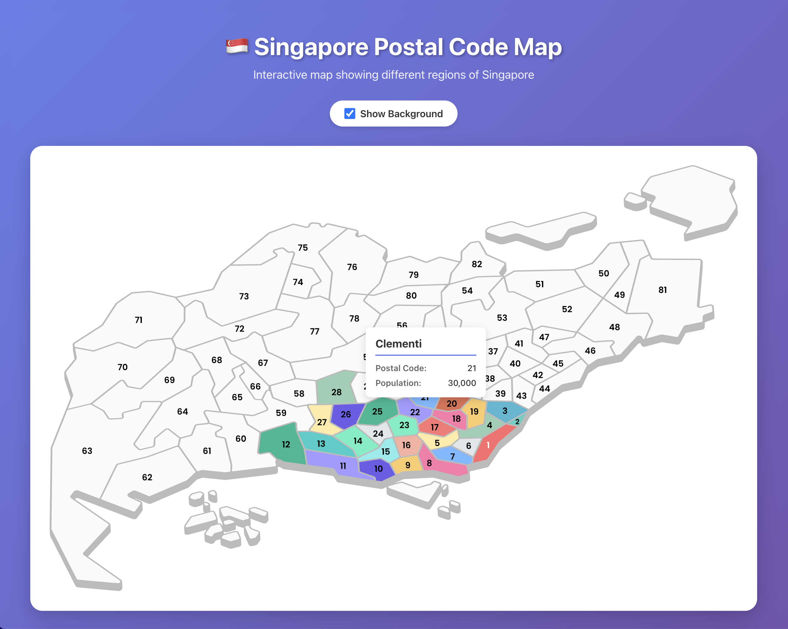

# Singapore Postal Code Map Component

A React component for rendering an interactive SVG map of Singapore with customizable content display based on postal codes.



## Usage

### Props

- **`className`**: `string` - Optional CSS class for the root SVG
- **`background`**: `boolean` - Toggle rendering of the background group (default: `true`)
- **`regionFills`**: `Record<PostalCode, string>` - Define fill colors for regions by postal code
- **`defaultRegionFill`**: `string` - Fallback fill color for regions
- **`onRegionHover`**: `(postalCode: PostalCode) => void` - Callback when hovering over a region
- **`onRegionLeave`**: `(postalCode: PostalCode) => void` - Callback when leaving a region
- **`renderRegion`**: `(postalCode: PostalCode, coords: { cx, cy, r? }) => ReactNode` - Function to render content for postal code
- **`regionContents`**: `Record<PostalCode, ReactNode>` - Object containing content for postal codes (similar to regionFills)
- **`regionTextFills`**: `Record<PostalCode, string>` - Define fill colors for text labels by postal code
- **`defaultRegionTextFill`**: `string` - Fallback fill color for text labels
- **`placement`**: `ContentPlacement` - Content position relative to coordinates (default: `'topCenter'`)
  - Options: `'topLeft'` | `'topCenter'` | `'topRight'` | `'center'` | `'bottomLeft'` | `'bottomCenter'` | `'bottomRight'` | `'centerLeft'` | `'centerRight'`

### Example 1: Using renderRegion (function)

```tsx
<Map
    regionFills={{75: '#ff5252', 45: '#52ff7e'}}
    onRegionHover={(postalCode) => console.log('hover', postalCode)}
    onRegionLeave={(postalCode) => console.log('leave', postalCode)}
    renderRegion={(postalCode, {cx, cy, r}) => {
        if (postalCode === 75) {
            return <div style={{backgroundColor: 'red', borderRadius: 12}}>
                {`Postal Code ${postalCode} at (${cx}, ${cy})`}
            </div>
        }
        return null;
    }}
    placement="topCenter"
/>
```

### Example 2: Using regionContents (object)

```tsx
<Map
    regionFills={{75: '#ff5252', 45: '#52ff7e'}}
    onRegionHover={(postalCode) => console.log('hover', postalCode)}
    onRegionLeave={(postalCode) => console.log('leave', postalCode)}
    regionContents={{
        75: <div style={{backgroundColor: 'red', borderRadius: 12}}>Postal Code 75</div>,
        45: <div style={{backgroundColor: 'blue', borderRadius: 12}}>Postal Code 45</div>,
    }}
    placement="bottomCenter"
/>
```

### Example 3: Different placement options

```tsx
// Content positioned at top-left of coordinate
<Map
    regionContents={{75: <div>Content</div>}}
    placement="topLeft"
/>

// Content centered on coordinate (like a pin)
<Map
    regionContents={{75: <div>Content</div>}}
    placement="center"
/>

// Content positioned at bottom-right of coordinate
<Map
    regionContents={{75: <div>Content</div>}}
    placement="bottomRight"
/>
```

## Notes

- `renderRegion` has higher priority than `regionContents`
- Content width is automatically determined by its inner content
- The `placement` prop controls how content is positioned relative to the coordinate point
- Element IDs in SVG must follow the format: `Dot<postal_code>` (e.g., Dot75, Dot45) to display content at postal code locations
- Path IDs must follow the format: `Path<postal_code>` (e.g., Path75, Path45) to define regions by postal code

## Development

### Build the package

```bash
npm run build
```

This will create the distribution files in the `dist/` folder.

## License

MIT
